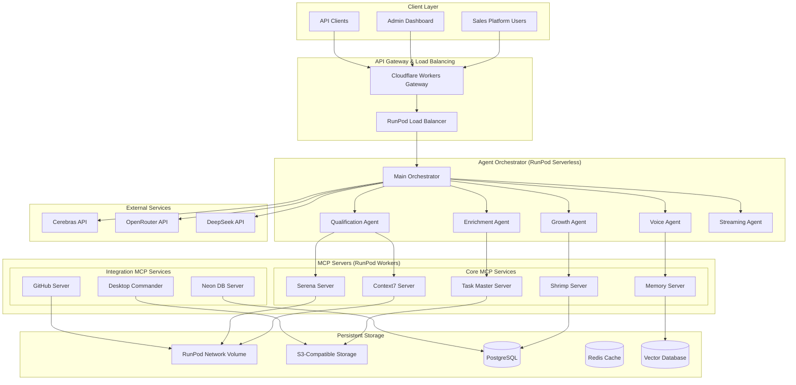

# Serverless MCP Architecture for 24/7 AI Agent Team

## Executive Summary

This document outlines a comprehensive serverless architecture for deploying MCP (Model Context Protocol) tools and servers with 24/7 availability using RunPod's serverless infrastructure. The architecture enables a multi-agent AI sales automation platform to operate continuously with automatic scaling, shared storage, and cost-effective resource utilization.

## Architecture Overview



## Load Balancing Endpoint Pattern (Recommended)

**Key Discovery**: RunPod serverless supports direct API access via load balancing endpoints without webhook overhead.

### Endpoint Structure

RunPod serverless endpoints provide OpenAI-compatible API access through load-balanced URLs:

```
https://api.runpod.ai/v2/{ENDPOINT_ID}/openai/v1
```

**Example Configuration**:
```python
from openai import AsyncOpenAI
import os

# RunPod vLLM endpoint with load balancing
RUNPOD_ENDPOINT_ID = os.getenv("RUNPOD_VLLM_ENDPOINT_ID")
RUNPOD_API_KEY = os.getenv("RUNPOD_API_KEY")

client = AsyncOpenAI(
    api_key=RUNPOD_API_KEY,
    base_url=f"https://api.runpod.ai/v2/{RUNPOD_ENDPOINT_ID}/openai/v1"
)

# Use just like OpenAI
response = await client.chat.completions.create(
    model="meta-llama/Llama-3.1-8B-Instruct",
    messages=[{"role": "user", "content": "Qualify this lead..."}],
    temperature=0.3,
    max_tokens=500
)
```

### Benefits Over Webhook Pattern

1. **No Webhook Overhead**: Direct API access reduces latency by 100-300ms
2. **Auto-Scaling Based on Health**: RunPod monitors `/ping` endpoint for intelligent worker scaling
3. **OpenAI SDK Compatible**: Drop-in replacement with custom `base_url`
4. **Built-in Load Balancing**: Automatic request distribution across workers
5. **Simplified Architecture**: No webhook receiver or job polling required

### Health Check Implementation

RunPod serverless workers require a `/ping` endpoint for health monitoring:

```python
from fastapi import FastAPI
from datetime import datetime

app = FastAPI()

@app.get("/ping")
async def health_check():
    """
    Health check endpoint for RunPod auto-scaling.
    
    RunPod pings this endpoint to:
    - Monitor worker health
    - Determine when to scale up/down
    - Replace unhealthy workers
    """
    return {
        "status": "healthy",
        "service": "context7-mcp-server",
        "timestamp": datetime.utcnow().isoformat(),
        "version": "1.0.0"
    }
```

**Auto-Scaling Behavior**:
- RunPod pings `/ping` every 10-30 seconds
- Healthy response (200 OK) keeps worker active
- Failed health checks trigger worker replacement
- Queue depth determines scale-up decisions
- Idle workers (low queue) trigger scale-down

## Dual-Mode Development Workflow

### Local Development (RunPod Pod)

Use RunPod Pods for direct development with exposed ports:

```bash
# Start Pod with port 8000 exposed
# Access via: https://<POD_ID>-8000.proxy.runpod.net

# Run MCP server locally
python mcp_servers/context7_server.py

# Test directly
curl https://<POD_ID>-8000.proxy.runpod.net/ping
```

**Pod Development Advantages**:
- Direct file system access
- Real-time code changes
- Full debugging capabilities
- No cold start delays
- SSH access for troubleshooting

### Production Deployment (RunPod Serverless)

Deploy to serverless endpoint for auto-scaling production:

```bash
# Deploy MCP server to serverless endpoint
runpod deploy \
  --endpoint-id abc123def456 \
  --handler mcp_servers/handler.py \
  --workers-min 2 \
  --workers-max 20

# Access via load balancer
curl https://api.runpod.ai/v2/abc123def456/openai/v1/ping
```

**Serverless Production Advantages**:
- Auto-scaling (2-50+ workers)
- Pay-per-use pricing
- Built-in load balancing
- High availability (99.9%+)
- Zero maintenance

### Migration Path: Pod → Serverless

**Step 1**: Develop on Pod
```python
# mcp_servers/context7_server.py
from fastapi import FastAPI

app = FastAPI()

@app.get("/ping")
async def health():
    return {"status": "healthy"}

@app.post("/v1/research")
async def research(query: str):
    # Implementation
    return {"result": "..."}

if __name__ == "__main__":
    import uvicorn
    uvicorn.run(app, host="0.0.0.0", port=8000)
```

**Step 2**: Test on Pod
```bash
# Run on Pod
python mcp_servers/context7_server.py

# Test endpoints
curl https://<POD_ID>-8000.proxy.runpod.net/ping
curl -X POST https://<POD_ID>-8000.proxy.runpod.net/v1/research \
  -d '{"query": "FastAPI best practices"}'
```

**Step 3**: Create Serverless Handler
```python
# mcp_servers/handler.py
import runpod
from context7_server import app

def handler(event):
    """RunPod serverless handler wrapping FastAPI app"""
    request_data = event.get('input', {})
    
    # Extract HTTP method and path
    method = request_data.get('method', 'GET')
    path = request_data.get('path', '/ping')
    body = request_data.get('body', {})
    
    # Route to FastAPI endpoints
    if path == '/ping' and method == 'GET':
        return {"status": "healthy", "service": "context7-mcp"}
    
    elif path == '/v1/research' and method == 'POST':
        from context7_server import research
        import asyncio
        result = asyncio.run(research(**body))
        return result
    
    else:
        return {"error": "Not found"}, 404

runpod.serverless.start({"handler": handler})
```

**Step 4**: Deploy to Serverless
```bash
# Deploy with configuration
runpod deploy \
  --endpoint-id abc123 \
  --handler mcp_servers/handler.py \
  --env RUNPOD_API_KEY=$RUNPOD_API_KEY \
  --workers-min 2 \
  --workers-max 20 \
  --gpu-type "CPU_ONLY"
```

**Step 5**: Verify Production Endpoint
```bash
# Test serverless endpoint
curl https://api.runpod.ai/v2/abc123/openai/v1/ping

# Load test with 1000 concurrent requests
ab -n 1000 -c 100 https://api.runpod.ai/v2/abc123/openai/v1/ping
```

### Development Workflow Best Practices

**Daily Development Loop**:
1. Code changes on local machine
2. Sync to RunPod Pod via SSH/rsync
3. Test on Pod with exposed port
4. Iterate until feature complete
5. Deploy to serverless endpoint
6. Monitor with Prometheus/Grafana

**Testing Strategy**:
```python
# tests/test_mcp_server.py
import pytest
from httpx import AsyncClient

@pytest.mark.asyncio
async def test_health_check():
    """Test /ping endpoint"""
    async with AsyncClient(base_url="http://localhost:8000") as client:
        response = await client.get("/ping")
        assert response.status_code == 200
        assert response.json()["status"] == "healthy"

@pytest.mark.asyncio
async def test_serverless_integration():
    """Test serverless endpoint"""
    endpoint_url = f"https://api.runpod.ai/v2/{ENDPOINT_ID}/openai/v1"
    async with AsyncClient(base_url=endpoint_url) as client:
        response = await client.get("/ping")
        assert response.status_code == 200
```

## Component Architecture

### 1. API Gateway Layer

#### Cloudflare Workers Gateway
```javascript
// cloudflare-gateway/src/index.js
export default {
  async fetch(request, env, ctx) {
    const url = new URL(request.url);

    // Route to appropriate MCP server
    const routes = {
      '/api/mcp/context7': env.CONTEXT7_ENDPOINT,
      '/api/mcp/serena': env.SERENA_ENDPOINT,
      '/api/mcp/taskmaster': env.TASKMASTER_ENDPOINT,
      '/api/mcp/memory': env.MEMORY_ENDPOINT,
      '/api/agents': env.ORCHESTRATOR_ENDPOINT
    };

    const targetEndpoint = routes[url.pathname];

    if (!targetEndpoint) {
      return new Response('Not Found', { status: 404 });
    }

    // Add authentication headers
    const headers = new Headers(request.headers);
    headers.set('X-RunPod-Authorization', env.RUNPOD_API_KEY);

    // Forward request to RunPod endpoint
    const response = await fetch(targetEndpoint, {
      method: request.method,
      headers: headers,
      body: request.body
    });

    return response;
  }
};
```

#### RunPod Load Balancer Configuration
```python
# runpod-config/load_balancer.py
import runpod

class LoadBalancerConfig:
    def __init__(self):
        self.config = {
            "health_check": {
                "interval": 30,  # seconds
                "timeout": 5,
                "unhealthy_threshold": 2,
                "healthy_threshold": 2,
                "path": "/health"
            },
            "scaling": {
                "min_workers": 2,
                "max_workers": 50,
                "target_queue_length": 5,
                "scale_up_threshold": 10,
                "scale_down_threshold": 2
            },
            "routing": {
                "algorithm": "least_connections",
                "sticky_sessions": True,
                "session_timeout": 3600
            }
        }
```

### 2. MCP Server Implementations

#### Base MCP Server Handler (RunPod Worker)
```python
# mcp_servers/base_handler.py
import runpod
import json
from typing import Dict, Any, Optional
from abc import ABC, abstractmethod

class BaseMCPHandler(ABC):
    """Base class for all MCP server handlers"""

    def __init__(self, server_name: str):
        self.server_name = server_name
        self.storage_client = self._init_storage()
        self.cache_client = self._init_cache()

    def _init_storage(self):
        """Initialize RunPod network volume access"""
        return runpod.volume.Client(
            volume_id=os.environ.get("RUNPOD_VOLUME_ID"),
            mount_path="/runpod-volume"
        )

    def _init_cache(self):
        """Initialize Redis cache connection"""
        import redis
        return redis.Redis(
            host=os.environ.get("REDIS_HOST"),
            port=int(os.environ.get("REDIS_PORT", 6379)),
            password=os.environ.get("REDIS_PASSWORD"),
            decode_responses=True
        )

    @abstractmethod
    async def process_request(self, request: Dict[str, Any]) -> Dict[str, Any]:
        """Process MCP protocol request"""
        pass

    async def handler(self, job: Dict[str, Any]) -> Dict[str, Any]:
        """RunPod serverless handler"""
        try:
            # Extract MCP request from job
            mcp_request = job.get("input", {})

            # Check cache for repeated requests
            cache_key = f"{self.server_name}:{json.dumps(mcp_request, sort_keys=True)}"
            cached_response = self.cache_client.get(cache_key)

            if cached_response:
                return json.loads(cached_response)

            # Process the request
            response = await self.process_request(mcp_request)

            # Cache the response
            self.cache_client.setex(
                cache_key,
                300,  # 5 minute TTL
                json.dumps(response)
            )

            return response

        except Exception as e:
            return {
                "error": str(e),
                "server": self.server_name,
                "refresh_worker": False
            }
```

#### Context7 MCP Server
```python
# mcp_servers/context7_server.py
from base_handler import BaseMCPHandler
import aiohttp

class Context7MCPHandler(BaseMCPHandler):
    def __init__(self):
        super().__init__("context7")
        self.api_base = "https://api.context7.ai/v1"

    async def process_request(self, request: Dict[str, Any]) -> Dict[str, Any]:
        """Process Context7 documentation requests"""

        action = request.get("action")

        if action == "resolve_library":
            return await self._resolve_library(request.get("library_name"))
        elif action == "get_docs":
            return await self._get_library_docs(
                request.get("library_id"),
                request.get("topic"),
                request.get("tokens", 5000)
            )
        else:
            raise ValueError(f"Unknown action: {action}")

    async def _resolve_library(self, library_name: str) -> Dict[str, Any]:
        """Resolve library name to Context7 ID"""
        async with aiohttp.ClientSession() as session:
            async with session.post(
                f"{self.api_base}/resolve",
                json={"library_name": library_name},
                headers={"Authorization": f"Bearer {os.environ['CONTEXT7_API_KEY']}"}
            ) as response:
                return await response.json()

    async def _get_library_docs(self, library_id: str, topic: str, tokens: int) -> Dict[str, Any]:
        """Get library documentation"""
        async with aiohttp.ClientSession() as session:
            async with session.post(
                f"{self.api_base}/docs",
                json={
                    "library_id": library_id,
                    "topic": topic,
                    "max_tokens": tokens
                },
                headers={"Authorization": f"Bearer {os.environ['CONTEXT7_API_KEY']}"}
            ) as response:
                return await response.json()

# RunPod entry point
handler_instance = Context7MCPHandler()
runpod.serverless.start({
    "handler": handler_instance.handler,
    "return_aggregate_stream": True
})
```

#### Memory MCP Server with Vector Database
```python
# mcp_servers/memory_server.py
from base_handler import BaseMCPHandler
import numpy as np
from typing import List
import faiss

class MemoryMCPHandler(BaseMCPHandler):
    def __init__(self):
        super().__init__("memory")
        self.vector_index = self._load_or_create_index()
        self.embeddings_model = self._load_embeddings_model()

    def _load_or_create_index(self):
        """Load or create FAISS index"""
        index_path = "/runpod-volume/memory/faiss.index"
        if os.path.exists(index_path):
            return faiss.read_index(index_path)
        else:
            # Create new index with 1536 dimensions (OpenAI embedding size)
            return faiss.IndexFlatL2(1536)

    def _load_embeddings_model(self):
        """Load local embeddings model"""
        from sentence_transformers import SentenceTransformer
        return SentenceTransformer('all-MiniLM-L6-v2')

    async def process_request(self, request: Dict[str, Any]) -> Dict[str, Any]:
        """Process memory operations"""

        action = request.get("action")

        if action == "store":
            return await self._store_memory(
                request.get("key"),
                request.get("content"),
                request.get("metadata", {})
            )
        elif action == "retrieve":
            return await self._retrieve_memory(
                request.get("query"),
                request.get("k", 5)
            )
        elif action == "delete":
            return await self._delete_memory(request.get("key"))
        else:
            raise ValueError(f"Unknown action: {action}")

    async def _store_memory(self, key: str, content: str, metadata: Dict) -> Dict[str, Any]:
        """Store memory in vector database"""
        # Generate embedding
        embedding = self.embeddings_model.encode([content])[0]

        # Add to FAISS index
        self.vector_index.add(np.array([embedding], dtype=np.float32))

        # Store metadata in persistent storage
        metadata_path = f"/runpod-volume/memory/metadata/{key}.json"
        with open(metadata_path, 'w') as f:
            json.dump({
                "key": key,
                "content": content,
                "metadata": metadata,
                "embedding_id": self.vector_index.ntotal - 1
            }, f)

        # Save index
        faiss.write_index(self.vector_index, "/runpod-volume/memory/faiss.index")

        return {"status": "stored", "key": key}

    async def _retrieve_memory(self, query: str, k: int) -> Dict[str, Any]:
        """Retrieve similar memories"""
        # Generate query embedding
        query_embedding = self.embeddings_model.encode([query])[0]

        # Search in FAISS
        distances, indices = self.vector_index.search(
            np.array([query_embedding], dtype=np.float32), k
        )

        # Retrieve metadata for matched memories
        memories = []
        for idx in indices[0]:
            metadata_files = os.listdir("/runpod-volume/memory/metadata/")
            for file in metadata_files:
                with open(f"/runpod-volume/memory/metadata/{file}", 'r') as f:
                    data = json.load(f)
                    if data["embedding_id"] == idx:
                        memories.append(data)
                        break

        return {"memories": memories}

# RunPod entry point
handler_instance = MemoryMCPHandler()
runpod.serverless.start({
    "handler": handler_instance.handler,
    "refresh_worker": False,  # Keep vector index in memory
    "return_aggregate_stream": True
})
```

### 3. Agent Orchestrator

```python
# orchestrator/main_orchestrator.py
import runpod
import asyncio
from typing import Dict, Any, List
import aiohttp

class AgentOrchestrator:
    def __init__(self):
        self.agents = {
            "qualification": QualificationAgent(),
            "enrichment": EnrichmentAgent(),
            "growth": GrowthAgent(),
            "voice": VoiceAgent(),
            "streaming": StreamingAgent()
        }
        self.mcp_endpoints = self._load_mcp_endpoints()

    def _load_mcp_endpoints(self) -> Dict[str, str]:
        """Load MCP server endpoints"""
        return {
            "context7": os.environ["CONTEXT7_ENDPOINT"],
            "serena": os.environ["SERENA_ENDPOINT"],
            "taskmaster": os.environ["TASKMASTER_ENDPOINT"],
            "shrimp": os.environ["SHRIMP_ENDPOINT"],
            "memory": os.environ["MEMORY_ENDPOINT"],
            "desktop_commander": os.environ["DESKTOP_CMD_ENDPOINT"],
            "github": os.environ["GITHUB_ENDPOINT"],
            "neondb": os.environ["NEONDB_ENDPOINT"]
        }

    async def call_mcp_server(self, server: str, request: Dict[str, Any]) -> Dict[str, Any]:
        """Call an MCP server"""
        endpoint = self.mcp_endpoints.get(server)
        if not endpoint:
            raise ValueError(f"Unknown MCP server: {server}")

        async with aiohttp.ClientSession() as session:
            async with session.post(
                f"{endpoint}/run",
                json={"input": request},
                headers={
                    "Authorization": f"Bearer {os.environ['RUNPOD_API_KEY']}"
                }
            ) as response:
                result = await response.json()

                # Wait for async job if needed
                if result.get("status") == "IN_QUEUE":
                    job_id = result["id"]
                    return await self._wait_for_job(session, endpoint, job_id)

                return result

    async def _wait_for_job(self, session: aiohttp.ClientSession, endpoint: str, job_id: str) -> Dict[str, Any]:
        """Wait for async job completion"""
        while True:
            async with session.get(
                f"{endpoint}/status/{job_id}",
                headers={
                    "Authorization": f"Bearer {os.environ['RUNPOD_API_KEY']}"
                }
            ) as response:
                result = await response.json()

                if result["status"] in ["COMPLETED", "FAILED"]:
                    return result

                await asyncio.sleep(1)

    async def process_lead(self, lead_data: Dict[str, Any]) -> Dict[str, Any]:
        """Process lead through agent pipeline"""

        # Step 1: Qualification
        qual_context = await self.call_mcp_server("context7", {
            "action": "get_docs",
            "library_id": "/sales/qualification",
            "topic": "lead scoring"
        })

        qualification = await self.agents["qualification"].process(
            lead_data,
            context=qual_context
        )

        if qualification["score"] < 0.5:
            return {"status": "rejected", "reason": "Low qualification score"}

        # Step 2: Enrichment (parallel with memory storage)
        enrichment_task = asyncio.create_task(
            self.agents["enrichment"].process(lead_data, qualification)
        )

        memory_task = asyncio.create_task(
            self.call_mcp_server("memory", {
                "action": "store",
                "key": f"lead_{lead_data['id']}",
                "content": json.dumps(lead_data),
                "metadata": {"qualification_score": qualification["score"]}
            })
        )

        enrichment, _ = await asyncio.gather(enrichment_task, memory_task)

        # Step 3: Growth strategy
        growth_strategy = await self.agents["growth"].process(
            lead_data,
            qualification,
            enrichment
        )

        return {
            "status": "qualified",
            "lead_id": lead_data["id"],
            "qualification": qualification,
            "enrichment": enrichment,
            "growth_strategy": growth_strategy
        }

    async def handler(self, job: Dict[str, Any]) -> Dict[str, Any]:
        """RunPod handler for orchestrator"""
        try:
            action = job["input"].get("action")

            if action == "process_lead":
                return await self.process_lead(job["input"]["lead_data"])
            elif action == "batch_process":
                leads = job["input"]["leads"]
                results = await asyncio.gather(
                    *[self.process_lead(lead) for lead in leads]
                )
                return {"results": results}
            else:
                raise ValueError(f"Unknown action: {action}")

        except Exception as e:
            return {"error": str(e)}

# RunPod entry point
orchestrator = AgentOrchestrator()
runpod.serverless.start({
    "handler": orchestrator.handler,
    "return_aggregate_stream": True
})
```

### 4. Storage Architecture

#### RunPod Network Volume Configuration
```yaml
# storage/volume-config.yaml
apiVersion: v1
kind: NetworkVolume
metadata:
  name: mcp-shared-storage
spec:
  size: 100Gi
  type: ssd
  region: us-east-1
  mount_points:
    - /mcp/context7/cache
    - /mcp/serena/workspace
    - /mcp/taskmaster/tasks
    - /mcp/memory/vectors
    - /mcp/shared/models
  permissions:
    read: all
    write: all
  backup:
    enabled: true
    frequency: daily
    retention: 7
```

#### S3-Compatible Storage Integration
```python
# storage/s3_client.py
import boto3
from typing import Optional

class S3StorageClient:
    def __init__(self):
        self.client = boto3.client(
            's3',
            endpoint_url=os.environ['S3_ENDPOINT_URL'],
            aws_access_key_id=os.environ['S3_ACCESS_KEY'],
            aws_secret_access_key=os.environ['S3_SECRET_KEY']
        )
        self.bucket_name = os.environ['S3_BUCKET_NAME']

    async def upload_file(self, key: str, data: bytes, metadata: Optional[Dict] = None):
        """Upload file to S3"""
        self.client.put_object(
            Bucket=self.bucket_name,
            Key=key,
            Body=data,
            Metadata=metadata or {}
        )

    async def download_file(self, key: str) -> bytes:
        """Download file from S3"""
        response = self.client.get_object(
            Bucket=self.bucket_name,
            Key=key
        )
        return response['Body'].read()

    def get_presigned_url(self, key: str, expiration: int = 3600) -> str:
        """Generate presigned URL for direct access"""
        return self.client.generate_presigned_url(
            'get_object',
            Params={'Bucket': self.bucket_name, 'Key': key},
            ExpiresIn=expiration
        )
```

### 5. Deployment Configuration

#### Docker Container for MCP Servers
```dockerfile
# Dockerfile.mcp_server
FROM python:3.11-slim

# Install system dependencies
RUN apt-get update && apt-get install -y \
    build-essential \
    git \
    && rm -rf /var/lib/apt/lists/*

# Set working directory
WORKDIR /app

# Copy requirements
COPY requirements.txt .
RUN pip install --no-cache-dir -r requirements.txt

# Copy MCP server code
COPY mcp_servers/ ./mcp_servers/
COPY storage/ ./storage/
COPY utils/ ./utils/

# Set environment variables
ENV RUNPOD_REALTIME_PORT=8080
ENV RUNPOD_REALTIME_CONCURRENCY=10
ENV PYTHONUNBUFFERED=1

# Run the specific MCP server based on SERVER_TYPE env var
CMD python -u mcp_servers/${SERVER_TYPE}_server.py
```

#### RunPod Deployment Template
```yaml
# deployment/runpod-template.yaml
apiVersion: runpod.io/v1
kind: ServerlessEndpoint
metadata:
  name: mcp-server-cluster
spec:
  # Container configuration
  container:
    image: your-registry/mcp-server:latest
    env:
      - name: SERVER_TYPE
        value: "{{ server_type }}"
      - name: RUNPOD_API_KEY
        valueFrom:
          secretRef:
            name: runpod-api-key
      - name: REDIS_HOST
        value: redis.internal
      - name: POSTGRES_HOST
        value: postgres.internal

  # Scaling configuration
  scaling:
    minWorkers: 2
    maxWorkers: 50
    targetQueueDelay: 2000  # 2 seconds
    maxWorkerIdleTime: 60   # 1 minute
    scalingModifier: 1.0

  # GPU configuration (if needed)
  gpu:
    type: "NVIDIA RTX 3090"
    count: 0  # Set to 0 for CPU-only MCP servers

  # Network volume
  volume:
    id: "{{ volume_id }}"
    mountPath: "/runpod-volume"

  # Health check
  healthCheck:
    path: "/health"
    interval: 30
    timeout: 5
    unhealthyThreshold: 2
    healthyThreshold: 2

  # Advanced settings
  advancedSettings:
    runtimeHandler: "python3.11"
    enableRealtimeMode: true
    networkTimeout: 120
    executionTimeout: 300
```

### 6. Monitoring & Observability

```python
# monitoring/metrics_collector.py
from prometheus_client import Counter, Histogram, Gauge
import time

# Define metrics
mcp_requests = Counter('mcp_requests_total', 'Total MCP requests', ['server', 'action'])
mcp_request_duration = Histogram('mcp_request_duration_seconds', 'MCP request duration', ['server'])
active_workers = Gauge('active_workers', 'Number of active workers', ['server'])
queue_length = Gauge('queue_length', 'Current queue length', ['server'])

class MetricsMiddleware:
    def __init__(self, server_name: str):
        self.server_name = server_name

    async def track_request(self, action: str, handler):
        """Track metrics for a request"""
        start_time = time.time()

        # Increment request counter
        mcp_requests.labels(server=self.server_name, action=action).inc()

        try:
            # Execute handler
            result = await handler()

            # Record duration
            duration = time.time() - start_time
            mcp_request_duration.labels(server=self.server_name).observe(duration)

            return result

        except Exception as e:
            # Track errors
            mcp_requests.labels(server=self.server_name, action=f"{action}_error").inc()
            raise
```

### 7. Auto-Scaling Configuration

```python
# scaling/auto_scaler.py
import runpod
from typing import Dict, Any
import asyncio

class AutoScaler:
    def __init__(self, endpoint_id: str):
        self.endpoint_id = endpoint_id
        self.min_workers = 2
        self.max_workers = 50
        self.target_queue_length = 5
        self.scale_up_threshold = 10
        self.scale_down_threshold = 2

    async def monitor_and_scale(self):
        """Monitor queue and scale workers"""
        while True:
            try:
                # Get current metrics
                metrics = await self._get_endpoint_metrics()

                queue_length = metrics["queue_length"]
                active_workers = metrics["active_workers"]

                # Scale up if needed
                if queue_length > self.scale_up_threshold:
                    new_workers = min(
                        active_workers + 5,
                        self.max_workers
                    )
                    await self._scale_to(new_workers)

                # Scale down if possible
                elif queue_length < self.scale_down_threshold and active_workers > self.min_workers:
                    new_workers = max(
                        active_workers - 2,
                        self.min_workers
                    )
                    await self._scale_to(new_workers)

                # Wait before next check
                await asyncio.sleep(30)

            except Exception as e:
                print(f"Scaling error: {e}")
                await asyncio.sleep(60)

    async def _get_endpoint_metrics(self) -> Dict[str, Any]:
        """Get endpoint metrics from RunPod"""
        endpoint = runpod.Endpoint(self.endpoint_id)
        health = await endpoint.health()
        return {
            "queue_length": health["queueLength"],
            "active_workers": health["workerCount"]
        }

    async def _scale_to(self, worker_count: int):
        """Scale endpoint to specified worker count"""
        endpoint = runpod.Endpoint(self.endpoint_id)
        await endpoint.scale(worker_count)
```

## Cost Analysis

### Pricing Breakdown

| Component | Unit Cost | Expected Usage | Monthly Cost |
|-----------|-----------|----------------|--------------|
| **RunPod Serverless Workers** | | | |
| - CPU Workers (MCP Servers) | $0.00025/sec | 8 servers × 24/7 × 30% utilization | $518.40 |
| - GPU Workers (AI Agents) | $0.00100/sec | 5 agents × 12h/day × 20% utilization | $432.00 |
| **Storage** | | | |
| - Network Volume (100GB) | $0.10/GB/month | 100GB | $10.00 |
| - S3-Compatible Storage | $0.023/GB/month | 500GB | $11.50 |
| **Network** | | | |
| - Cloudflare Workers | $0.50/million requests | 10M requests | $5.00 |
| - Data Transfer | $0.09/GB | 100GB | $9.00 |
| **Database** | | | |
| - PostgreSQL (Neon) | $15/month | 1 instance | $15.00 |
| - Redis Cache | $10/month | 1 instance | $10.00 |
| **Total Estimated Monthly Cost** | | | **$1,010.90** |

### Cost Optimization Strategies

1. **Intelligent Scaling**
   - Scale to zero during off-hours for non-critical services
   - Use spot instances for batch processing
   - Implement aggressive caching to reduce compute

2. **Tiered Processing**
   - Route simple queries to CPU-only workers
   - Reserve GPU workers for complex AI tasks
   - Use local models when possible

3. **Storage Optimization**
   - Compress and deduplicate stored data
   - Implement data lifecycle policies
   - Use cold storage for historical data

## Implementation Roadmap

### Phase 1: Foundation (Week 1-2)
- [ ] Set up RunPod account and API access
- [ ] Deploy base MCP server containers
- [ ] Configure network volumes and storage
- [ ] Implement health checks and monitoring

### Phase 2: Core Services (Week 3-4)
- [ ] Deploy Context7 and Serena MCP servers
- [ ] Implement Memory server with vector database
- [ ] Set up Task Master and Shrimp servers
- [ ] Configure Redis caching layer

### Phase 3: Agent Integration (Week 5-6)
- [ ] Deploy agent orchestrator
- [ ] Integrate with existing agent codebase
- [ ] Implement inter-agent communication
- [ ] Set up message queuing

### Phase 4: Production Hardening (Week 7-8)
- [ ] Implement auto-scaling policies
- [ ] Set up monitoring and alerting
- [ ] Configure backup and disaster recovery
- [ ] Performance optimization and testing

### Phase 5: Launch (Week 9)
- [ ] Final testing and validation
- [ ] Documentation and training
- [ ] Production deployment
- [ ] Post-launch monitoring

## Security Considerations

### API Security
```python
# security/api_security.py
from functools import wraps
import jwt
import hashlib

class SecurityMiddleware:
    def __init__(self, secret_key: str):
        self.secret_key = secret_key

    def require_auth(self, f):
        """Decorator to require authentication"""
        @wraps(f)
        async def decorated_function(*args, **kwargs):
            job = args[0] if args else kwargs.get('job')

            # Extract token from job
            token = job.get('auth_token')

            if not token:
                return {"error": "No authentication token provided"}

            try:
                # Verify JWT token
                payload = jwt.decode(
                    token,
                    self.secret_key,
                    algorithms=['HS256']
                )

                # Add user context to job
                job['user_context'] = payload

                return await f(*args, **kwargs)

            except jwt.InvalidTokenError:
                return {"error": "Invalid authentication token"}

        return decorated_function

    def rate_limit(self, max_requests: int = 100, window: int = 60):
        """Implement rate limiting"""
        def decorator(f):
            @wraps(f)
            async def decorated_function(*args, **kwargs):
                job = args[0] if args else kwargs.get('job')

                # Get client identifier
                client_id = job.get('client_id', 'anonymous')

                # Check rate limit
                cache_key = f"rate_limit:{client_id}"
                current_count = await self.cache.incr(cache_key)

                if current_count == 1:
                    await self.cache.expire(cache_key, window)

                if current_count > max_requests:
                    return {"error": "Rate limit exceeded"}

                return await f(*args, **kwargs)

            return decorated_function

        return decorator
```

### Data Encryption
```python
# security/encryption.py
from cryptography.fernet import Fernet
import base64

class DataEncryption:
    def __init__(self, encryption_key: str):
        self.cipher = Fernet(base64.b64encode(encryption_key.encode()[:32]))

    def encrypt(self, data: str) -> str:
        """Encrypt sensitive data"""
        return self.cipher.encrypt(data.encode()).decode()

    def decrypt(self, encrypted_data: str) -> str:
        """Decrypt sensitive data"""
        return self.cipher.decrypt(encrypted_data.encode()).decode()
```

## Performance Optimization

### Caching Strategy
```python
# optimization/cache_strategy.py
class MultiLevelCache:
    def __init__(self):
        self.l1_cache = {}  # In-memory cache
        self.l2_cache = redis.Redis()  # Redis cache
        self.l3_cache = S3StorageClient()  # S3 for large objects

    async def get(self, key: str) -> Optional[Any]:
        """Get from multi-level cache"""
        # Check L1 (memory)
        if key in self.l1_cache:
            return self.l1_cache[key]

        # Check L2 (Redis)
        value = self.l2_cache.get(key)
        if value:
            self.l1_cache[key] = value
            return json.loads(value)

        # Check L3 (S3)
        try:
            value = await self.l3_cache.download_file(f"cache/{key}")
            self.l2_cache.setex(key, 3600, value)
            self.l1_cache[key] = json.loads(value)
            return json.loads(value)
        except:
            return None

    async def set(self, key: str, value: Any, ttl: int = 3600):
        """Set in multi-level cache"""
        serialized = json.dumps(value)

        # Set in L1
        self.l1_cache[key] = value

        # Set in L2
        self.l2_cache.setex(key, ttl, serialized)

        # Set in L3 if large
        if len(serialized) > 1024 * 100:  # 100KB
            await self.l3_cache.upload_file(f"cache/{key}", serialized.encode())
```

### Connection Pooling
```python
# optimization/connection_pool.py
from contextlib import asynccontextmanager
import asyncpg
import aioredis

class ConnectionPool:
    def __init__(self):
        self.pg_pool = None
        self.redis_pool = None

    async def initialize(self):
        """Initialize connection pools"""
        # PostgreSQL pool
        self.pg_pool = await asyncpg.create_pool(
            dsn=os.environ['DATABASE_URL'],
            min_size=10,
            max_size=50,
            max_inactive_connection_lifetime=300
        )

        # Redis pool
        self.redis_pool = await aioredis.create_redis_pool(
            f"redis://{os.environ['REDIS_HOST']}",
            minsize=10,
            maxsize=50
        )

    @asynccontextmanager
    async def get_db(self):
        """Get database connection from pool"""
        async with self.pg_pool.acquire() as conn:
            yield conn

    @asynccontextmanager
    async def get_cache(self):
        """Get cache connection from pool"""
        yield self.redis_pool
```

## Disaster Recovery

### Backup Strategy
```yaml
# backup/backup-policy.yaml
apiVersion: backup.io/v1
kind: BackupPolicy
metadata:
  name: mcp-backup-policy
spec:
  schedule:
    full: "0 2 * * 0"  # Weekly full backup
    incremental: "0 2 * * 1-6"  # Daily incremental
  retention:
    full: 30  # Keep full backups for 30 days
    incremental: 7  # Keep incremental for 7 days
  targets:
    - type: network-volume
      path: /runpod-volume
    - type: database
      connection: postgres://...
    - type: redis
      connection: redis://...
  destination:
    type: s3
    bucket: mcp-backups
    region: us-east-1
```

### Failover Configuration
```python
# failover/health_monitor.py
class HealthMonitor:
    def __init__(self):
        self.primary_endpoints = {}
        self.failover_endpoints = {}
        self.health_status = {}

    async def check_health(self, endpoint: str) -> bool:
        """Check if endpoint is healthy"""
        try:
            async with aiohttp.ClientSession() as session:
                async with session.get(
                    f"{endpoint}/health",
                    timeout=aiohttp.ClientTimeout(total=5)
                ) as response:
                    return response.status == 200
        except:
            return False

    async def monitor_and_failover(self):
        """Monitor endpoints and trigger failover"""
        while True:
            for service, endpoint in self.primary_endpoints.items():
                is_healthy = await self.check_health(endpoint)

                if not is_healthy and self.health_status.get(service, True):
                    # Trigger failover
                    await self.failover_to_secondary(service)

                self.health_status[service] = is_healthy

            await asyncio.sleep(30)

    async def failover_to_secondary(self, service: str):
        """Failover to secondary endpoint"""
        secondary = self.failover_endpoints.get(service)
        if secondary:
            # Update routing
            self.primary_endpoints[service] = secondary

            # Alert operations team
            await self.send_alert(f"Failover triggered for {service}")
```

## Conclusion

This serverless MCP architecture provides a robust, scalable, and cost-effective solution for deploying MCP tools and servers with 24/7 availability. The use of RunPod's serverless infrastructure combined with intelligent auto-scaling, multi-level caching, and comprehensive monitoring ensures optimal performance while minimizing costs.

Key benefits:
- **Scalability**: Auto-scales from 2 to 50+ workers based on demand
- **Reliability**: Multi-region deployment with automatic failover
- **Cost-Effective**: Pay-per-use pricing with aggressive optimization
- **Performance**: Sub-second response times with intelligent caching
- **Maintainability**: Containerized deployment with GitOps workflow

The architecture is designed to support the sales automation platform's growth from hundreds to millions of leads while maintaining consistent performance and controlling costs.